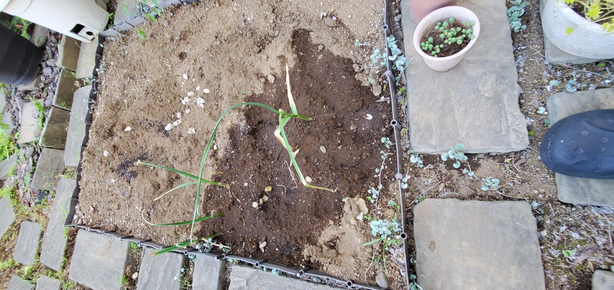

<!-- _class: title -->
# AIで『自分』を再発見する
〜日々の記録とマルチモーダルの未来〜

松田 晴史
投資テック同好会

---
<!-- header: プロフィール・現在の取り組み -->

今取り組んでいること

* 学内フリマアプリの開発
* 投資テック同好会の大学公認化
* Claudeのアンバサダー
* ニンニク育成中
  

申請中のプロジェクト

* トビタテ！留学JAPAN（申請中）
* 目的：多様な幸福の形を実感するため
* 様々な価値観に触れる狙い

---
<!-- header: 本日のテーマ -->

問い：自分とは何か？

* AIを使って「自分とは何か」を発見できるのではないか？
* 自分自身という、最も身近で最も難解な対象へのアプローチ

---
<!-- header: 背景と仮説 -->

人生の迷い

* 過去に人生で苦しんでいた
* 根本にあった疑問：「自分とは何なのか？」

解決への仮説

* なにが欲しいか、どこに進むべきか
* 自分自身がクリアになれば
* → 結果として「幸福」に近づけるはず

---
<!-- header: 気づきと実践 -->

過去のヒント

* 昔の自分を振り返ると…
* 気づけば頻繁に『遺書』を書いていた

ポップな「遺書」の再定義

* （決して暗い話ではありません！）
* 毎日をリセットし、今の思いを書き出す
* 人生で欲しいものは何か？をテキストで記録

---
<!-- header: AIによる自己分析 -->

データとしての思考

* 毎日書き続けたテキストデータ ＝ 思考のログ
* 実際に2ヶ月間、このデータをAIに分析・トラッキングさせた
* 感情の揺れや行動の記録から「自分でも気づかない法則」を抽出

---
<!-- header: 洞察①：幸福度が上がる確実な条件 -->

満足度が高かった日の記録

* 友人とのランニング＋にんにく栽培
* 高校の友人と会う、一緒に行動する
* 1万7千歩歩く、ただ外を歩く、ネカフェ泊

共通する3つの絶対条件

1. 「波長の合う人間」と同じ空間にいる
2. 身体を動かして外に出ている
3. 評価と無関係な「小さな行動」（栽培、歩く等）

---
<!-- header: 洞察②：幸福を妨げる「3つの慢性的な摩擦」 -->

AIが見抜いたボトルネック

* ⚠️ **摩擦①：評価の二重拘束**
  「見られたい」と「見られるのが怖い」が同じ強度で共存している。これが開発の進行を止める根本原因。
* ⚠️ **摩擦②：虚無の慢性化**
  虚無の対義語は幸福ではなく「誰かといる・何かに触れる接続感」。
* ⚠️ **摩擦③：身体の問題（副鼻腔などの体調不良）**
  例外なく自発度をゼロにする。「頑張らない理由」を作り出す最大の要因。

---
<!-- header: ネクストアクション：最もコスパが高い行動 -->

3ヶ月で最も「幸福に近づける」行動ランキング

* **第1位：副鼻腔の治療を予約する（今週中）**
  * 「頑張れない」日の7割が体調不良と連動。ここがすべての基盤。
* **第2位：「波長が合う人間」と週に1回会う時間を作る**
  * 評価なしで人と会うことが、再現性のある幸福の条件。
* **第3位：ZAX（現状のプロダクト）を「実験ログ」にする**
  * 「自分のプロダクト」と思うと怖くて開けないので、評価対象から外す。

---
<!-- header: 今後の展望とまとめ -->

マルチモーダル化へ

* ゆくゆくはテキスト以外のデータも
* 睡眠データ・音声・表情など
* あらゆる生体情報を組み合わせた深い解析

まとめ

* 「自分」という最大のアセット（資産）
* AIを使って正しく理解し投資する
* より良い方向へ自分をアップデート

---
<!-- _class: title -->
# ご清聴ありがとうございました

  
  
投資テック同好会 X(Twitter) @musashinoinvest

